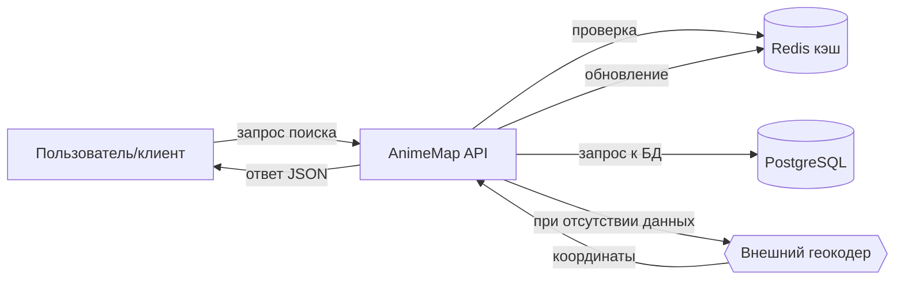

# Анализ процесса: AS IS и TO BE

Файл ведёт OpenCode. Обсудите с агентом содержание и проверьте предложенный diff. Все дополнения и исправления поручайте агенту в чате.

## AS IS

Ручной поиск локаций в Токио или Киото по форумам, Reddit, блогам и видео. Участники: фанаты/туристы и авторы контента. Задержки: 2–6 часов на сбор и проверку информации; данные разрознены, нет единого формата. Ручные операции: чтение постов, копирование описаний, сверка по картам, ручной ввод координат, сохранение заметок. Потери: неточности координат, дубли названий (JP/EN), устаревшие ссылки, отсутствие маршрута по нескольким точкам.

## TO BE

Мгновенный API-запрос с кэшированием: клиент обращается к AnimeMap API; система ищет по базе и кэшу Redis, при необходимости обращается к внешнему геокодеру (httpx) и обновляет кэш/базу. Пользователь получает точные координаты и добавляет локацию в избранное.

## Разница

| Что меняется | AS IS | TO BE | Как проверим изменение |
|---|---|---|---|
| Источник данных | Форумы/блоги вручную | Централизованный API + БД | Аналитика: сокращение ручных обращений/времени |
| Координаты | Часто неточные/устаревшие | Верифицированные и кэшируемые | Доля verified записей и скорость ответов |
| Время на поиск | Часы | Секунды | Usability-тесты, продуктовая аналитика |

## Как использовали AI

- Для чего: зафиксировать текущее и целевое состояние процесса поиска координат.
- Тип промпта: RCTF.
- Строка в [`prompts.md`](prompts.md): P1-05.
- Что проверил студент и какие исправления поручил агенту: корректность описания задержек и артефактов; правки после ревью при необходимости.
