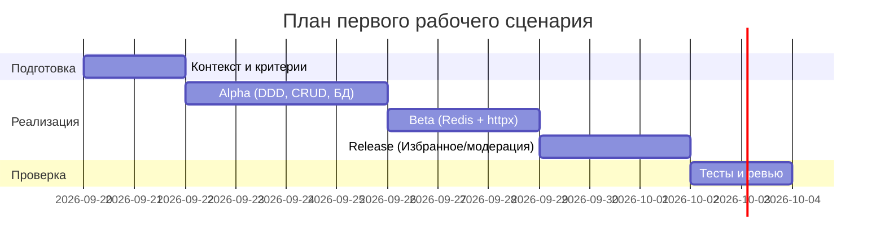

# План поставки

Файл ведёт OpenCode. Обсудите с агентом содержание и проверьте предложенный diff. Все дополнения и исправления поручайте агенту в чате.

## Инкременты и ответственность

| Инкремент | Наблюдаемый результат | Что делает человек | Что делает AI или субагент | Проверка | Зависимости |
|---|---|---|---|---|---|
| Alpha (DDD, БД и CRUD) | Структура модульного монолита (interfaces/application/domain/infrastructure); миграции Alembic; CRUD по локациям и пользователям с UUIDv4 | Определяет границы модулей, ревью схем и миграций | Генерирует каркас модулей, модели/схемы, CRUD и первую миграцию | Unit-тесты репозиториев и API; локальный прогон | Принятый ADR о модульном монолите |
| Beta (Redis + httpx геокодер) | Кэш поиска и координат (Redis); httpx-клиент к внешнему геокодеру с ретраями/тайм-аутами | Ревью политики TTL/инвалидации, настроек тайм-аутов | Реализация кэша, клиента геокодера, интеграционных тестов | Интеграционные тесты с моками внешних API; замер латентности | Alpha-инкремент |
| Release (Избранное и модерация) | API избранного; флаг верификации координат; базовые роли/права | Уточняет правила модерации, проводит финальное ревью | Реализация эндпоинтов избранного и модерации, миграции | E2E-тест: happy-path «Your Name»; регрессы | Beta-инкремент |

## Диаграмма Ганта

Передайте OpenCode даты и задачи своего плана и попросите обновить диаграмму.

## Как использовали AI

- Для чего: сформировать по инкрементам план поставки и роли команды для MVP AnimeMap API.
- Тип промпта: RCTF, планирование релиза.
- Строка в [`prompts.md`](prompts.md): P1-05.
- Что проверил студент и какие исправления поручил агенту: согласование длительностей и зависимостей; уточнение критериев проверки каждого инкремента.
